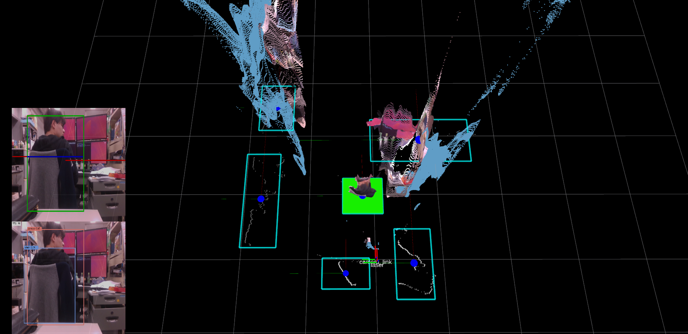

# Hokuyo and Camera Object Detection
In this repository, I compiled the source code using ROS for object detection.

## Overview
By integrating the data of 2D-LiDAR and camera, recgnize human position.

## Requirements
- ROS Kinetic(ubuntu 16.04)
- Python2.7+
- [tensorflow_objectdetection](https://github.com/tensorflow/models/tree/master/research/object_detection)
- [Opencv3](https://opencv.org/)
- [PCL1.8](https://pointcloud.org/)
- [realsense_camera](http://wiki.ros.org/realsense_camera)

## Hardware Spec
- PC
    - OS : Ubuntu16.04
    - Memory : 8GB
    - CPU : Intel® Core™ i7-6700
    - GPU : GeForce GTX 1050-Ti
- Sensors
    - URG-20(Hokuyo)
    - REALSENSE(Intel)

## How to Build

```
$cd $HOME
$cd catkin_ws/src
$git clone git@github.com:Sadaku1993/hokuyo_camera_calibration.git
$cd ..
$catkin_make
```

## How to run
```
$roscd hokuyo_camera_clibration/launch
$roslaunch hokuyo_camera_calibration run.launch
```


